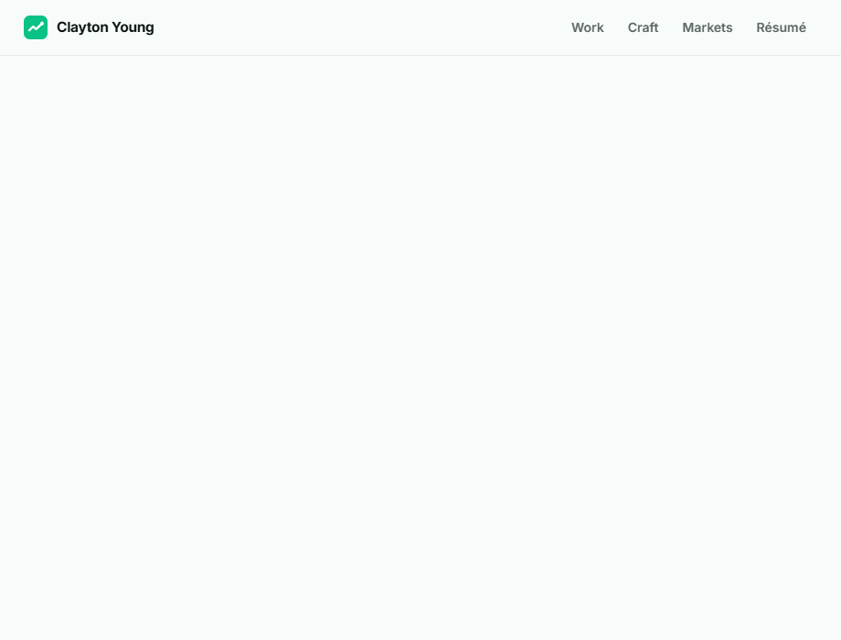

# Clayton Young — a portfolio built for Kalshi

The Product Designer posting said **“show us.”** So instead of attaching a PDF of screenshots, I designed and built a working portfolio in Kalshi's language — live market UI, cents pricing, and the design reasoning on every page.



**Live:** [kalshi-portfolio.pages.dev](https://kalshi-portfolio.pages.dev) · **Stack:** React · Next.js (App Router) · TypeScript · Framer Motion

---

## The pages

| | Page | What it shows |
|---|---|---|
| 01 | [Work](https://kalshi-portfolio.pages.dev/work) | Shipped products with real users — problem → design decisions → outcome, for each. |
| 02 | [Craft](https://kalshi-portfolio.pages.dev/craft) | An interaction lab: spring-tuned price motion, tabular numerals, Yes/No spread, order buttons — live, with the *why* under each. |
| 03 | [Markets](https://kalshi-portfolio.pages.dev/markets) | Why prediction markets have my full attention, plus a live Kalshi-style board (event contracts, Yes + No = 100¢). |
| 04 | [Résumé](https://kalshi-portfolio.pages.dev/resume) | Their requirements mapped line-by-line to proof, plus the one-page PDF. |

## Details I sweat

- **Prices glide on springs** — movement reads as information, not alarm; a soft spring for data, a snappy one for controls.
- **Tabular numerals everywhere a digit changes** — prices never jitter or reflow.
- **Color only ever means direction** — green/red are semantics, not decoration.
- **Reduced-motion support** — every animation collapses to an instant state change.
- **Static export, ~138 kB first load** — fast enough to feel like an exchange.

## Run it

```bash
npm install
npm run dev      # http://localhost:3000
```

## Build & deploy

```bash
npm run build    # static site in ./out
npx wrangler pages deploy out --project-name=kalshi-portfolio
```

Designed & built from scratch by [Clayton Young](https://github.com/Youngs-World) — [claytonryanyoung@gmail.com](mailto:claytonryanyoung@gmail.com)
